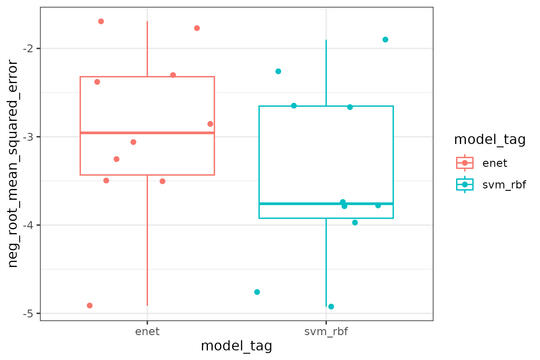

<!-- README.md is generated from README.Rmd. Please edit that file -->

# rpwf

<!-- badges: start -->

[](https://app.codecov.io/gh/hhp94/rpwf?branch=master)
<!-- badges: end -->

{rpwf} is a lightweight R and Python package that enables:

- data engineering in
  
  with [{tidymodels}](https://www.tidymodels.org/).
  - hyper parameter grids generation using the
    [{dials}](https://dials.tidymodels.org/) functions such as
    [`grid_max_entropy`](https://dials.tidymodels.org/reference/grid_max_entropy.html).  
  - vast libraries of cool data transformation methods such as splines
    basis expansion, data reduction, and multiple imputation.  
- testing the generated data transformation pipeline in
  
  with [scikit-learn](https://scikit-learn.org/stable/index.html).  
- streamlining the use of HPC and cloud computing to speed up feature
  engineering experimentation.

# Installation

## R

- Install the package from github

``` r
# install.packages("devtools")
devtools::install_github("hhp94/rpwf", branch = "master")
```

## Python

- Setup a python environment with conda

``` bash
conda create -n py39 python=3.9.13 anaconda
```

- You’ll need the the following python packages installed in your python
  environment. `pandas` and `scikit-learn` should already be installed
  with the above command.
  - sqlalchemy  
  - pandas  
  - pandas-downcast  
  - pyarrow  
  - scikit-learn  
  - xgboost  
  - pins
  - pyyaml
  - any other machine learning library such as `lightgbm` and etc.

``` bash
conda activate py39
conda install pyarrow sqlalchemy xgboost pyyaml
python -m pip install pandas-downcast
python -m pip install pins
```

- Next, copy the python codes into any folder with `rpwf_cp_py_codes()`.
  Here I’m just copying the codes to my `home/opt` folder.

``` r
list.files("~/opt") # Coping python codes to this folder
rpwf_cp_py_codes("~/opt")
list.files("~/opt") # A folder called "rpwf" is created
```

- Install the copied python codes as a local package for maximum
  flexibility. **Remember the -e flag**, this allows you to modify the
  python codes without re-installation.

``` bash
python -m pip install -e ~/opt/rpwf
#   Preparing metadata (setup.py) ... done
# Installing collected packages: local-rpwf
#   Running setup.py develop for local-rpwf
# Successfully installed local-rpwf-0.1.0
```

- Remove the package if needed with

``` bash
pip uninstall local-rpwf
# Found existing installation: local-rpwf 0.1.0
# Uninstalling local-rpwf-0.1.0:
#   Would remove:
#     .../local-rpwf.egg-link
# Proceed (Y/n)? Y
#   Successfully uninstalled local-rpwf-0.1.0
```

## Linux installation

The R [`{arrow}`](https://arrow.apache.org/) installation on linux might
fail. In which case, use this
[instruction](https://cran.r-project.org/web/packages/arrow/vignettes/install.html).
The following codes worked for me

``` r
Sys.setenv(NOT_CRAN = TRUE)
install.packages("arrow", repos = c(arrow = "https://nightlies.apache.org/arrow/r", getOption("repos")))
```

Or update your current build of arrow with

``` r
source("https://raw.githubusercontent.com/apache/arrow/master/r/R/install-arrow.R")
install_arrow(verbose = TRUE)
```

# Useage

- First, create a [`{pins}`](https://pins.rstudio.com/) board and a
  database

``` r
library(rpwf)
library(pins)
library(tidymodels)
library(ggplot2)

board <- board_temp() # Create a temp board from the pins package
tmp_dir <- withr::local_tempdir() # Temp folder
db_con <- rpwf_connect_db(paste(tmp_dir, "db.SQLite", sep = "/"), board) # Temp database
```

- Get the list of available models with

``` r
rpwf_avail_models(db_con)
```

- Then define your model(s) and recipe(s)

``` r
enet_model <- linear_reg(penalty = tune(),
                         mixture = tune()) |>
  set_engine("glmnet") |>
  set_mode("regression") |>
  # Set the py engine
  set_py_engine("sklearn.linear_model",
                "ElasticNet",
                rpwf_model_tag = "enet") |>
  # Set the engine specific grid
  set_r_grid(dials::grid_regular, levels = 10)

svm_rbf_model <- svm_rbf(cost = tune(),
                         margin = tune()) |>
  set_engine("kernlab") |>
  set_mode("regression") |>
  # Set the py engine
  set_py_engine("sklearn.svm",
                "SVR",
                rpwf_model_tag = "svm_rbf",
                kernel = "rbf",
                # fix kernel parameter = "rbf"
                cache_size = 500) |>
  # Set the engine specific grid
  set_r_grid(dials::grid_regular, levels = 10)

normalize_recipe <- recipe(mpg ~ ., data = mtcars) |> 
  step_normalize(all_predictors())
```

- Create the workflowset and export the information

``` r
wf <- rpwf_workflow_set(
  preprocs = list(normalize_recipe), 
  models = list(enet_model, svm_rbf_model), 
  costs = "neg_root_mean_squared_error"
) |> 
  rpwf_augment(db_con = db_con)

rpwf_write_grid(wf) # Write the parquets for the train data
rpwf_write_df(wf) # Write the parquets for the hyper param grids
rpwf_export_db(wf, db_con) # Write the information in the database
# Write the board information in a YAML file
rpwf_write_board_yaml(board, paste(tmp_dir, "board.yml", sep = "/"))
```

- Run the workflow in Python

``` bash
python -m rpwf.script.nested_resampling $<path to the db> -b $<path to board yaml> \
  -a -c 7 -icv 5 -icr 2 -ocv 5 -ocr 2
```

- Plot the results

``` r
wf_results <- rpwf_results(db_con)
p <- wf_results |>
  tidyr::unnest(fit_results) |>
  ggplot(aes(y = neg_root_mean_squared_error, x = model_tag, color = model_tag)) +
  geom_boxplot() +
  geom_jitter() +
  theme_bw()

p
```

<!--  -->


